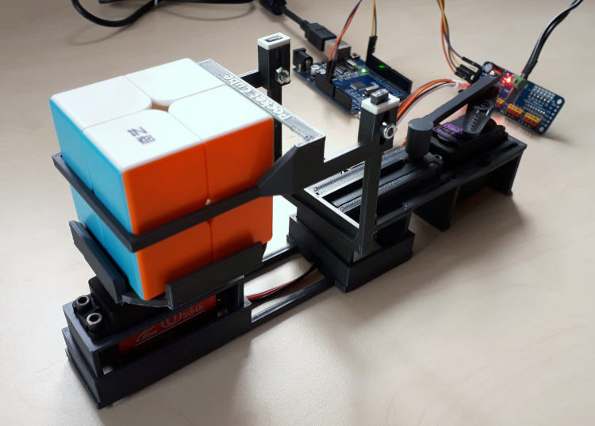
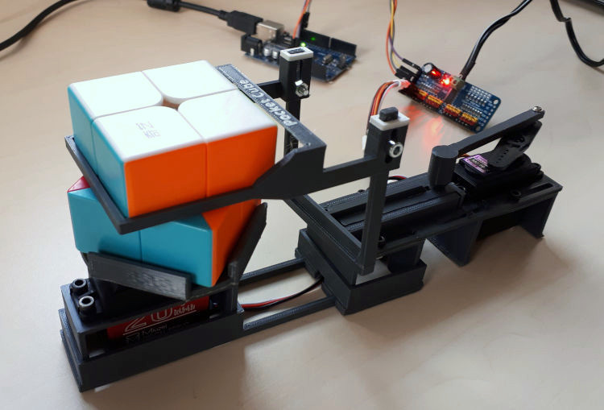
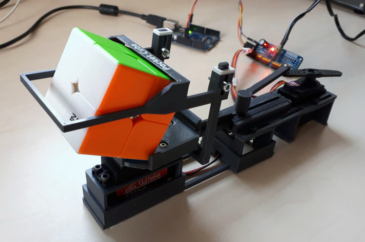
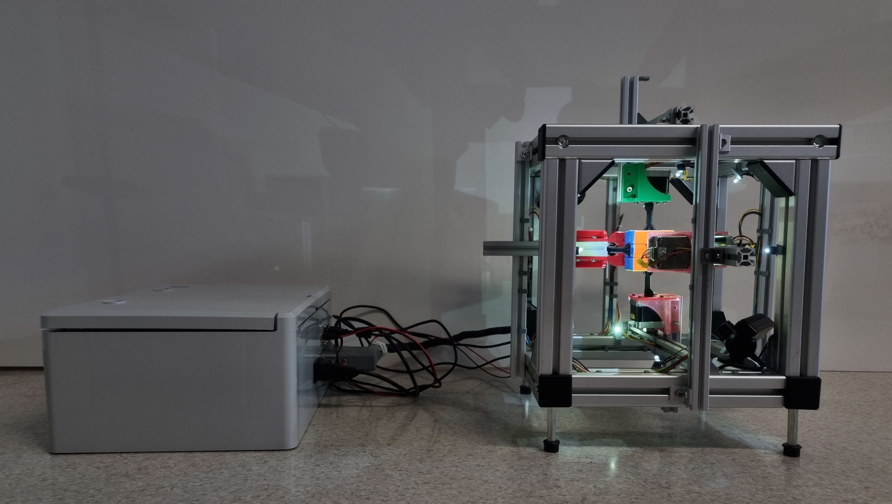
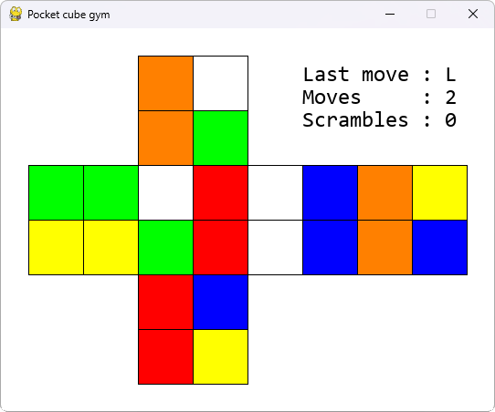
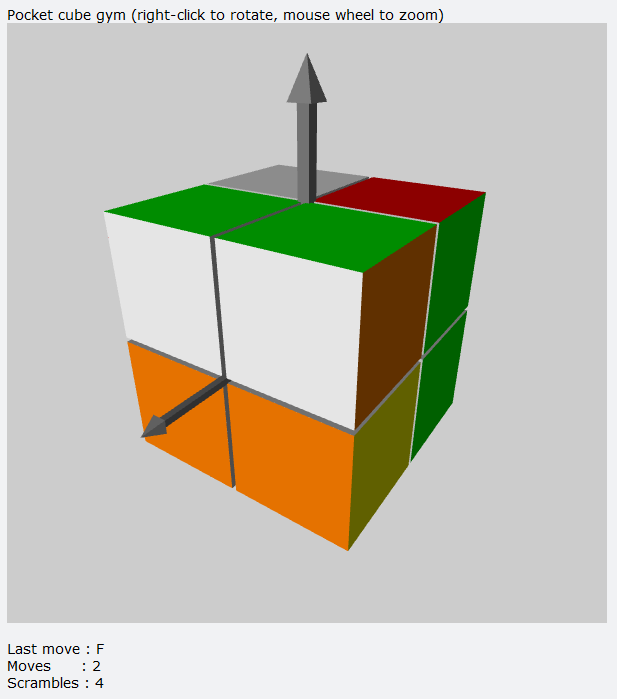

# Pocket Cube and Rubik's Cube Solvers
Dealing with artificial intelligence (AI), we were curious how to let computers learn
to solve a scrambled Pocket cube (2x2x2) or Rubik's cube (3x3x3). Okay, this is challenging enough.
Still, wouldn't it be even more fun to demonstrate the results by machines that _mechanically_ solve physical cubes?
Join us on this fascinating endeavor. 

## Overview
This is what we did so far:
1. _Rubik's cube device:_ A team of five students has built a high-performance device for Rubik's cube based on lots 
of fancy hardware and a provided algorithm. The movements to solve a scrambled cube take well below 1 s.
2. _Deep learning:_ In scope of his Master thesis, Finn Lanz has implemented, analyzed, and modified approaches based on reinforcement learning to let computers learn how to solve cubes. Due to required resources, the experiments focused on Pocket cubes.
3. _Pocket cube device:_ I have developed a low-cost device to mechanically solve scrambled Pocket cubes. (Finn and I wanted to have a cool hardware demonstrator for his Master thesis.)

### Pocket cube device
The _Pocket cube solver_ shown in the images below is, on purpose, based on low-cost hardware, consisting mainly of an Arduino board, two servo motors, a PWM module, and 3D-printed parts. In case you want to rebuild the device, please note the detailed [documentation](docs/) in the folder "docs" describing assembly, calibration, and the software. All [source files](src/pocket_cube_device) (Arduino, Python) are located in "src/pocket_cube_device", and the [3D print files on Thingiverse](https://www.thingiverse.com/thing:5822433). Additionally, there is a short [video file](assets/videos) in "assets/videos".

  

### Rubik's cube device
The _Rubik's cube solver_ shown in the image below consists of a control cabinet with motor drivers, microcontroller, and such (left) and the hardware containing the cube, motors, cameras, and such (right). The device is operated by a Laptop connected to the control cabinet. The [project report](docs/) (German) providing technical information is in "docs". Additionally, there is a short [video file](assets/videos) in "assets/videos" which shows a cube being scrambled twice (slowly) and solved (much faster). We intend to provide more information and source codes after a review - please be patient.

### Deep learning
In scope of his Master thesis, Finn has trained several models to solve scrambled Pocket cubes. Furthermore, he has developed a program to scan the colors of Pocket cubes placed in the Pocket cube device and physically unscramble them. The [Master thesis](docs/) is available in the folder "docs" (in German language). An extended [OpenAI gym environment](src/pocket_cube_gym) with 2D and 3D rendering and a simple [sample agent and policy](src/pocket_cube_models/sample) to demonstrate its use are in "src". The application software and training of more sophisticated models will follow - please be patient.

 

## Upload status (uploaded or still to come)
- [X] Master thesis on reinforcement learning and Pocket cube solver
- [X] Pocket cube device (documentation, 3D print files, source codes)
- [x] Rubik's cube solver (documentation)
- [X] Reinforcement learning (gym environment, sample)
- [ ] Reinforcement learning (source codes to train models, trained models)
- [ ] Pocket cube application (including trained models)
- [ ] Rubik's cube solver (source codes)
- [ ] Refactoring of Rubik's cube device
- [ ] Better sample videos

## Contributors
My deepest thanks go to following  magnificent students of our  [Department at HAW Hamburg](https://www.haw-hamburg.de/hochschule/technik-und-informatik/departments/informations-und-elektrotechnik/studium/studiengaenge/), who raised my interest for this topic and contributed by their brilliant work done with remarkable passion:

- Sophie Kirchhoff (Rubik's cube device)
- Finn Lanz (reinforcement learning, integration of Pocket cube hardware)
- Kim Henrik Otte (Rubik's cube device)
- Marvin Paetow (Rubik's cube device)
- Christoph Rathjen (Rubik's cube device)
- Kim Kristin Westphal (Rubik's cube device)

## Contact
Marc Hensel, University of Applied Sciences Hamburg (HAW Hamburg)

http://www.haw-hamburg.de/marc-hensel
